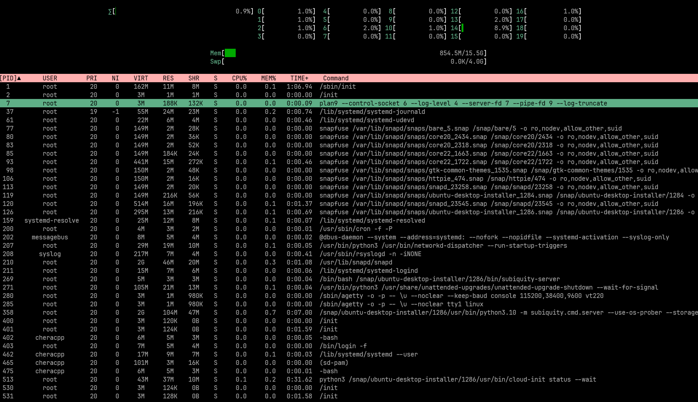

# System Metrics Monitor

## Introduction

System Metrics Monitor is a text-based user interface (TUI) application that collects and displays system metrics in real time. It's designed to monitor the performance of a Linux system, offering functionality similar to `htop`. The application is developed in C++ and leverages the FTXUI library to create the TUI.



## Feature Checklist

### Current Features

- [x] **CPU Usage**: Display real-time CPU usage metrics.
- [x] **Memory Usage**: Show current memory utilization.
- [x] **Process Monitoring**: Monitor and display active processes.

### Planned Features

- [ ] **Disk Usage**: Implement disk usage monitoring.
- [ ] **Help Window**: Create help window to list the keyboard shortcuts and commands.
- [ ] **Process Control**: add ability to send various signals to processes.

## Prerequisites

- CMake
- GNU Make
- A C++ compiler (e.g., g++, clang)

Ensure these are installed on your system before proceeding with the installation of the application.

## Installation Instructions

1. **Clone the repository:**

   ```bash
   git clone https://github.com/Cheracpp/System-Metrics-Monitor.git

2. **Build the project:**

    ```bash
    cd System_Metrics_Monitor
    mkdir build && cd build
    cmake ..
    make
    ```

3. **Run the application:**

    ```bash
    ./system_metrics_monitor
    ```

